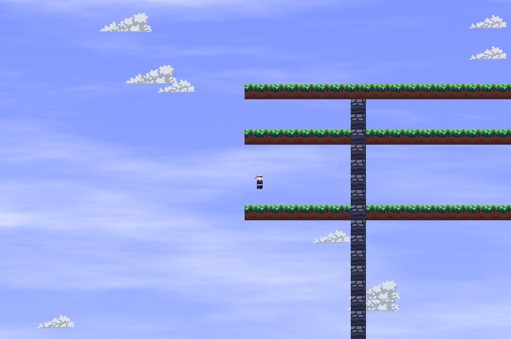

# Platformer

This project is a basic Pygame that was built as a learning exercise. While the core mechanics like player physics and movement have been implemented using Object-Oriented Programming principles. I have tried to clearly seperate the files and used typehints to improve code readability, the game is far from complete. Feel free extend it!

assets by DaFluffyPotato

clone the repo and do python -m game from project directory  (make sure to install pygame)